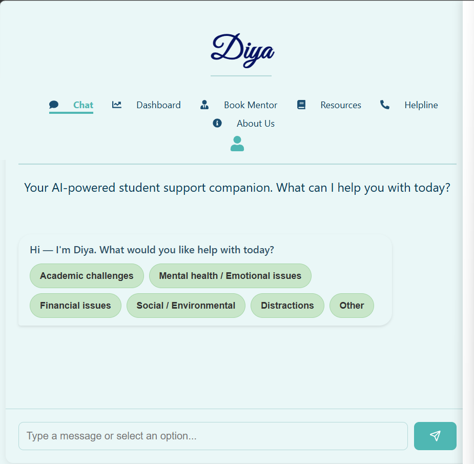
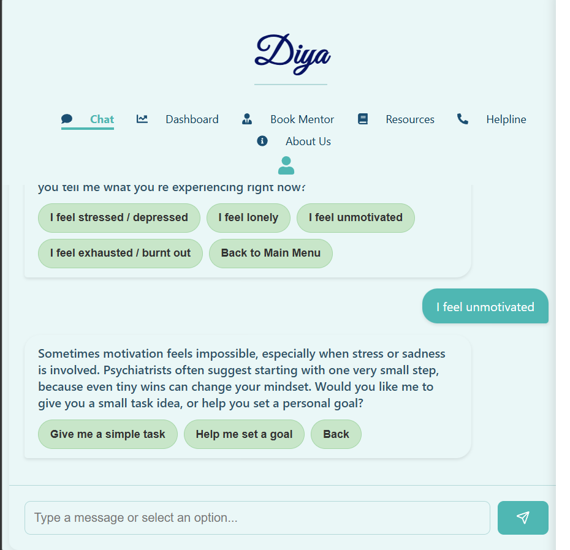
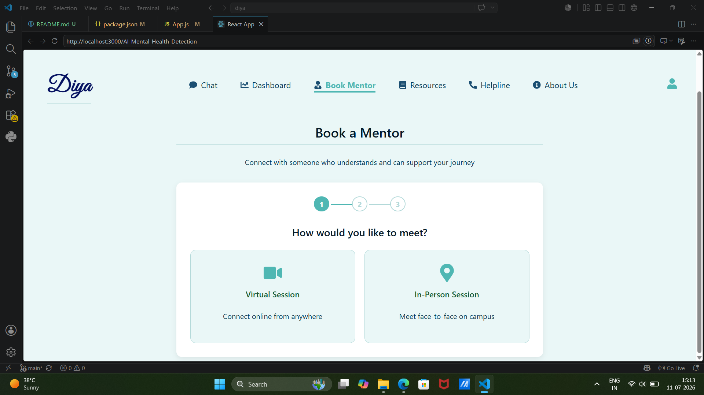
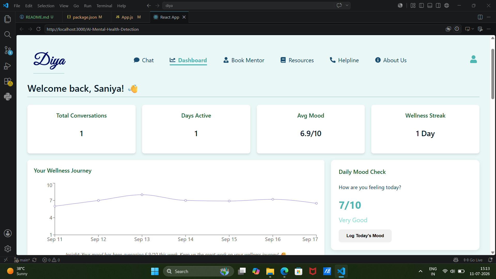
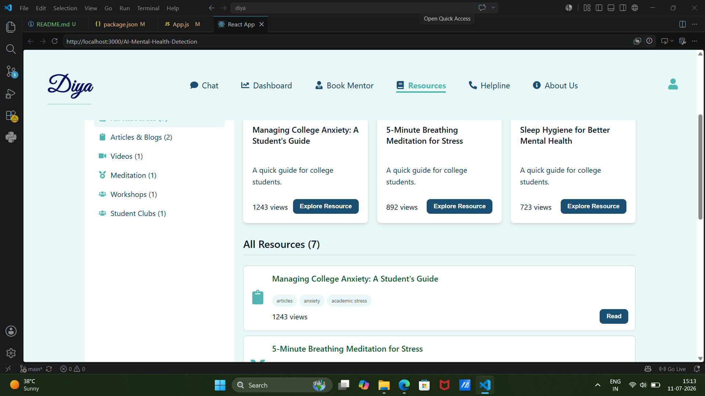
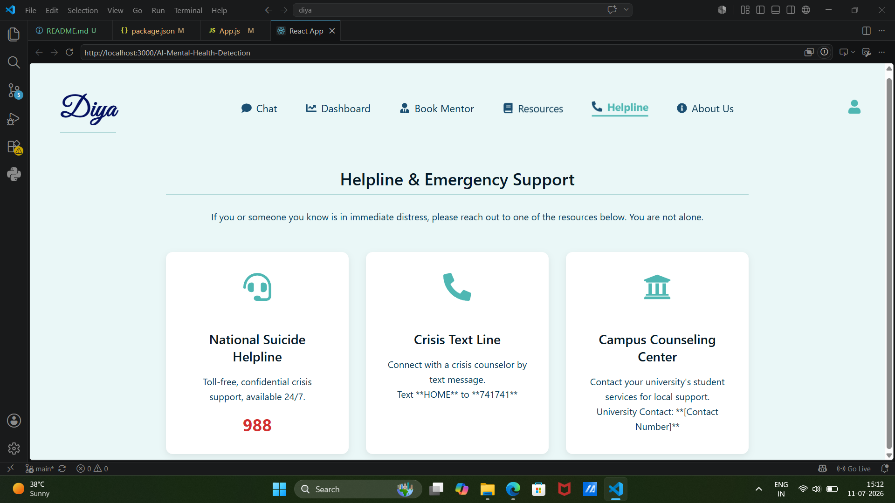

<p align="center">
  
</p>

<h1 align="center">🧠 Diya</h1>

<p align="center">
AI-Powered Mental Health Detection Platform
</p>

<p align="center">


</p>

An AI-powered mental health detection platform designed to help users identify potential mental health concerns through intelligent assessments, interactive conversations, and personalized recommendations. The platform combines Artificial Intelligence with a modern full-stack web application to provide an engaging, secure, and user-friendly experience.

---

> **Note:** This repository showcases my contributions to the collaborative **Diya** project. My primary contributions include frontend development, UI enhancement, testing, and bug fixing.

## 🚀 Project Overview

Mental health has become one of the most important healthcare challenges worldwide. This project leverages Artificial Intelligence to analyze user responses, assess potential mental health conditions, and provide personalized guidance, educational resources, and chatbot-based support.

The application offers a responsive interface, intelligent chatbot interactions, and a scalable architecture suitable for future AI model enhancements.

---

## ✨ Features
- 🤖 AI-powered mental health assessment
- 💬 Interactive chatbot
- 🔐 Secure authentication
- 📱 Responsive UI
- 📊 Dashboard
- 🎯 Personalized recommendations

---

## 🛠 Tech Stack

### Frontend

* React.js
* HTML5
* CSS3
* JavaScript

### Backend

* Node.js
* Express.js

### Database

* MongoDB

### AI & Tools

* Machine Learning
* REST APIs
* Git & GitHub

---

## 📂 Project Structure

```text
Diya/
│
├── public/
├── src/
├── images/
├── package.json
├── package-lock.json
└── README.md
```

---

## 🎯 Objectives

* Detect potential mental health concerns using AI.
* Improve accessibility to mental health resources.
* Provide users with personalized insights.
* Deliver a responsive and intuitive user experience.
* Promote awareness through technology.

---

## 🔮 Future Enhancements

* Emotion detection using facial expressions
* Voice sentiment analysis
* LLM-powered mental health assistant
* Appointment booking with professionals
* Mobile application
* Multi-language support
* Advanced analytics dashboard

---

## 👩‍💻 My Contributions

As a Frontend Developer in this collaborative project, I contributed to:

- Developed responsive UI components using React.js.
- Implemented modern frontend features to improve user experience.
- Collaborated with teammates to integrate frontend modules with backend services.
- Performed application testing and debugging.
- Identified and fixed UI and functional bugs.
- Improved responsiveness across different screen sizes.
---

## Screenshots

### 🏡 Homepage Section




### 📅 Book a Mentor



### 📊 User Dashboard



### 📚 Mental Health Resources



### ☎️ Emergency Helpline



### ℹ️ About Us


---

## ⚙️ Installation

Clone the repository

```bash
git clone https://github.com/mohammedsaniya55-hash/AI-Mental-Health-Detection.git
```

Navigate to the project

```bash
cd AI-Mental-Health-Detection
```

Install dependencies

```bash
npm install
```

Start the application

```bash
npm start
```

## ⭐ Repository

If you find this project interesting, consider giving it a ⭐.

---

## 📄 License

This project is intended for educational and portfolio purposes.

## 📬 Connect With Me

**GitHub:** https://github.com/mohammedsaniya55-hash

**LinkedIn:** 
https://www.linkedin.com/in/saniya-mohammad-593b112a8
---

**Developed as a collaborative AI project focused on improving mental health awareness through intelligent technology.**

## 🤝 Acknowledgement

This repository showcases my contributions to the collaborative **Diya** project. My primary responsibilities included frontend development, UI enhancement, testing, and bug fixing.
